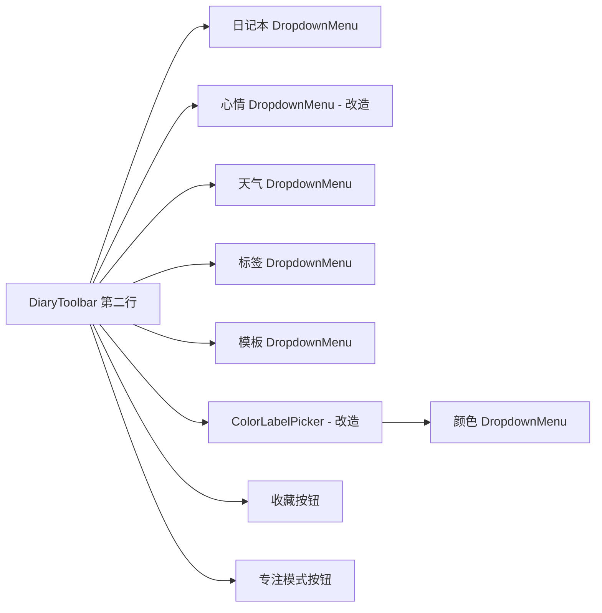

## 用户需求

日记文档工具栏存在两个问题需要修复：

1. **工具栏溢出问题**：窗口缩小时，两行工具栏的内容会超出容器，当前没有任何 overflow 处理机制
2. **表情和颜色选择方式改造**：心情（5个emoji）和颜色（8个色块+清除）当前直接平铺在工具栏上，需要改为下拉列表选择，与天气/标签/模板保持一致的交互模式

## 产品概述

将日记工具栏中平铺的心情emoji和颜色色块改为 DropdownMenu 下拉选择，同时在两行工具栏容器上添加溢出保护（overflow-x-auto + min-w-0），确保窄窗口下内容可滚动查看而非直接溢出。

## 核心功能

- 心情选择改为下拉菜单，显示当前心情emoji作为触发器，展开后列出5个选项
- 颜色选择改为下拉菜单，显示当前颜色色块（或默认提示文字）作为触发器，展开后列出8个颜色+清除选项
- 两行工具栏容器添加 overflow-x-auto 和 min-w-0，确保内容溢出时可水平滚动

## 技术栈

- 前端框架：React + TypeScript
- 样式方案：Tailwind CSS（内联样式，无独立 CSS 文件）
- UI 组件：项目中已有的 `DropdownMenu`（来自 `@/components/ui/dropdown-menu`）

## 实现方案

### 策略

1. **心情选择下拉化**：将 DiaryToolbar.tsx 第174-187行的5个emoji平铺按钮替换为一个 `DropdownMenu`，触发器显示当前心情emoji（或 Smiley 图标+提示文字），下拉列表中展示5个心情选项，选中项带对勾标记。复用已有的 `DropdownMenu`/`DropdownMenuTrigger`/`DropdownMenuContent`/`DropdownMenuItem` 组件，参考天气下拉的实现模式。
2. **颜色选择下拉化**：将 ColorLabelPicker.tsx 组件重构为下拉菜单模式。触发器显示当前选中的颜色小圆点（或 Palette 图标+提示文字），下拉列表中展示8个颜色选项（每个带色块+名称）+清除选项。同样复用 DropdownMenu 组件族。
3. **溢出保护**：在 DiaryToolbar.tsx 的两行容器 div 上分别添加 `overflow-x-auto` 和 `min-w-0` class，确保内容溢出时出现水平滚动条而非超出容器边界。

### 关键技术决策

- **不使用 flex-wrap**：工具栏按钮保持单行排列，使用 overflow-x-auto 滚动，避免换行导致工具栏高度不可控
- **颜色选择器保留独立组件**：ColorLabelPicker.tsx 仍作为独立组件存在，但内部改为下拉菜单实现，保持组件边界清晰
- **交互保持 toggle 行为**：下拉菜单中心情和颜色的选择逻辑保持不变——点击已选中的选项可以取消选择

### 实现注意事项

- 下拉菜单 align 使用 `"start"` 保持与天气/标签/模板一致
- 心情下拉菜单项使用 emoji + label 文字 + 选中对勾的布局
- 颜色下拉菜单项使用色块圆点 + label 文字 + 选中对勾的布局
- 添加 `overflow-x-auto` 后配合 `scrollbar-thin` 或隐藏滚动条样式（视项目是否已配置滚动条样式而定）

## 目录结构

```
apps/desktop/src-ui/src/document-types/diary/
├── DiaryToolbar.tsx          # [MODIFY] 心情选择改为下拉菜单；两行容器添加 overflow-x-auto + min-w-0
├── ColorLabelPicker.tsx      # [MODIFY] 颜色平铺改为下拉菜单实现
└── types.ts                   # [无需修改] MOOD_EMOJI/MOOD_LABEL/COLOR_LABELS 常量已满足需求
```

## 架构设计

改造前后的组件关系不变，仅改变心情和颜色选择的 UI 呈现方式：

