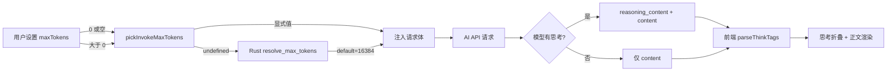

## 问题描述

将所有 provider 的 `default_max_tokens` 全部设为 0 后，所有 AI 侧边栏（文档类型侧边栏、插件面板等）只能显示思考过程，无法输出最终的正文内容。

## 根因分析

问题分为两个层面：

### 层面1：模型思考消耗全部输出预算

当 `max_tokens` 为 0 时，`resolve_max_tokens` 返回 `None`，`inject_max_tokens` 主动移除请求体中的 `max_tokens` 字段。对于支持深度思考的模型（Qwen3-max、DeepSeek、GLM-5 等），不设置 `max_tokens` 意味着模型可以将全部可用上下文窗口用于 `reasoning_content`（思考过程），直到达到模型最大输出限制才停止。此时思考过程已经耗尽了输出空间，没有剩余空间输出正文 `content`。前端 `parseThinkTags` 解析后 `content` 为空，只显示折叠的思考块。

### 层面2：PluginHostAPI 通过 `??` 运算符传递 0

`PluginHostAPI.ts` 中 `chat` 方法使用 `options?.maxTokens ?? 4096`，当用户设置中 `maxTokens = 0` 时，`0 ?? 4096` 仍为 `0`（`??` 只对 null/undefined 回退，不对 0 回退）。后端收到 `Some(0)` 后不注入 `max_tokens`，效果与层面1相同。

### 影响范围

- 所有文档类型 AI 侧边栏（翻译、日记、小说、股票研究等）
- 所有插件面板（思维导图、表格、总结等）
- 主聊天面板 `ChatPanel`
- 编码助手 `CodingAssistant`
- 帮助面板 `HelpAIChat`

## 技术方案

### 修复策略

采用**双保险策略**：同时修复后端和前端，确保无论 maxTokens 如何传递，都不会出现只输出思考过程的问题。

### 修改1：后端 `ai.rs` — 为每个 provider 设置合理的 default_max_tokens

将 `default_max_tokens` 从 0 改为合理的默认值，确保在用户未设置 maxTokens 时也有保障。

### 修改2：后端 `ai.rs` — resolve_max_tokens 增强

当 `enable_thinking` 为 true 且 `max_tokens` 为 None 时，自动设置一个较大的默认值（如 16384），确保模型有足够空间同时输出思考过程和正文。

### 修改3：前端 `PluginHostAPI.ts` — 修复 `??` 运算符

将 `options?.maxTokens ?? globalMaxTokens ?? 4096` 改为先检查 `> 0`，确保 0 不被当作有效值传递。

## 实现细节

### 文件修改清单

```
apps/desktop/
├── src-tauri/src/
│   └── ai.rs                         # [MODIFY] 修改 default_max_tokens 值
├── src-ui/src/plugins/_framework/
│   └── PluginHostAPI.ts              # [MODIFY] 修复 maxTokens 的 fallback 逻辑
```

### ai.rs 具体修改

**PROVIDER_REGISTRY 修改**：将所有 provider 的 `default_max_tokens` 从 `0` 改为合理值：

- 普通对话模型（OpenAI、Anthropic、Gemini）：`16384`
- 推理/思考模型（DeepSeek、Qwen、GLM）：`16384`（需要更大空间容纳思考+正文）
- 代码模型（glm-code、minimax-code、kimi-code、litellm）：`16384`
- Fallback 默认值：`16384`

**resolve_max_tokens 不需要修改**：当前逻辑已经正确，当 `requested > 0` 时使用显式值，否则使用 default（现在是 16384 而非 0）。

### PluginHostAPI.ts 具体修改

**chat 方法**（第425行）：

```typescript
// 修改前：
maxTokens: options?.maxTokens ?? 4096,
// 修改后：
maxTokens: (options?.maxTokens && options.maxTokens > 0) ? options.maxTokens : 4096,
```

**chatStream 方法**（第493行）：

```typescript
// 修改前：
maxTokens: options?.maxTokens ?? useSettingsStore.getState().ai.maxTokens ?? 4096,
// 修改后：
maxTokens: [options?.maxTokens, useSettingsStore.getState().ai.maxTokens].find(v => v && v > 0) ?? 4096,
```

### 不需要修改的文件

- `commands/ai.rs` 中的 `resolve_max_tokens` 和 `inject_max_tokens` 逻辑已正确处理 0 和 None
- `doctype-sdk/host.ts` 中的 `pickInvokeMaxTokens` 已正确过滤 `<= 0` 的值
- `useAppStore.ts` 中的 maxTokens 传递已正确过滤 `<= 0` 的值
- `CodingAssistant` 和 `HelpAIChat` 中的 maxTokens 传递已正确过滤

### 性能与兼容性分析

- 将 default_max_tokens 设为 16384 对绝大多数场景足够，不会限制模型输出
- 部分模型最大输出可能超过 16384（如 Gemini 的 1M tokens），此时用户可在设置中手动设置更大的值
- 该修改是向后兼容的：如果用户已设置 maxTokens > 0，显式值优先
- 16384 是一个保守值，对于思考模型也能容纳较长的思考过程后仍有空间输出正文

## 架构影响



## Agent Extensions

### SubAgent

- **code-explorer**
- Purpose: 在实现修复前再次验证所有 maxTokens 传递路径，确保没有遗漏的代码路径
- Expected outcome: 确认所有修改点的准确性，避免遗漏