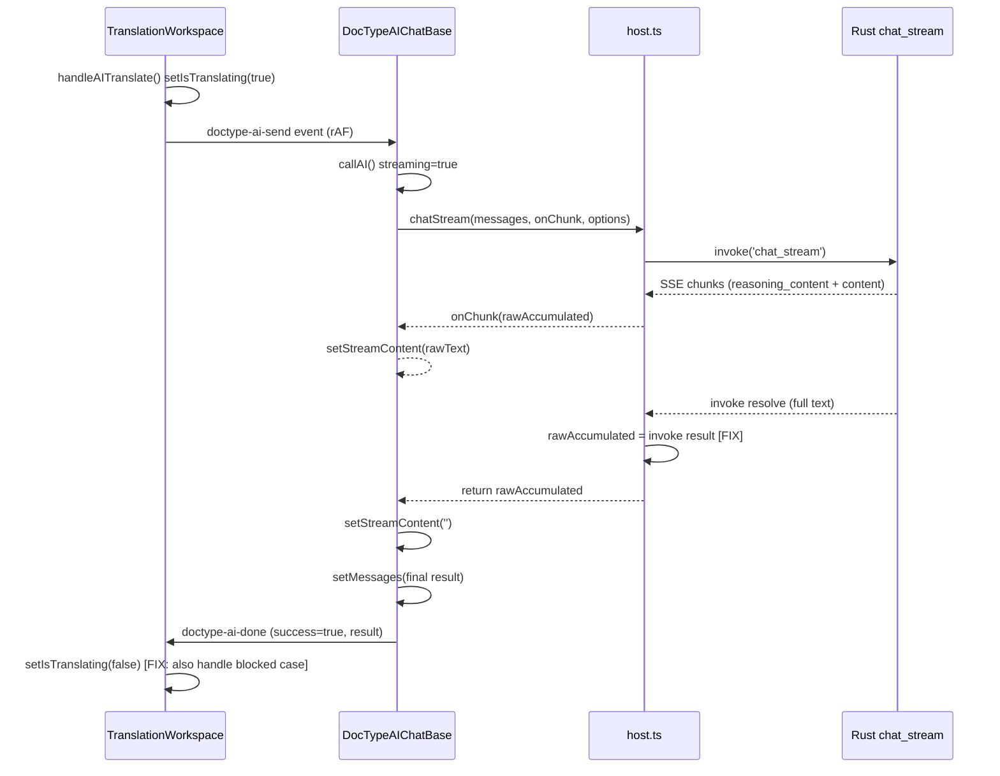

## Product Overview

修复翻译文档类型一键翻译功能的致命 Bug：思考过程能正常折叠呈现，但最终译文不出现，界面始终停留在"翻译中"状态。

## Core Features

- 修复 callAI 的 streaming 守卫边界条件：当 callAI 被 `if (streaming) return` 阻止时，不 dispatch 任何事件，导致 TranslationWorkspace 的 isTranslating 永远无法重置
- 修复 host.ts chatStream 丢弃 invoke 返回值的问题：invoke 返回 Rust 端完整累积文本，但被丢弃；返回的是 JS 端 SSE 监听器累积的 rawAccumulated，可能因 unlisten 时机丢失最后的正文 chunk

## Tech Stack

- React 18 + TypeScript
- Tauri (Rust 后端 + JS 前端)
- Zustand 状态管理
- 自定义事件驱动架构 (CustomEvent)

## Implementation Approach

### 根因分析

#### Bug 1: callAI 的 streaming 守卫导致 isTranslating 永不重置

**触发链条**:

1. `TranslationAISidebar` 传入 `onAIResponse` 为 inline 箭头函数（第 198 行）
2. `callAI` 的 useCallback 依赖数组包含 `onAIResponse`（第 238 行），因此每次 TranslationAISidebar 重渲染时 callAI 都会重建
3. `doctype-ai-send` 事件监听器依赖 `callAI`（第 296 行），callAI 每次变化时 useEffect 会解绑旧 handler、绑定新 handler
4. **关键时序**：当流式进行中（streaming=true）时，`setStreamContent(rawText)` 在每次 SSE chunk 到达时被调用，触发组件重渲染，进而导致 TranslationAISidebar 重渲染
5. TranslationAISidebar 重渲染 -> onAIResponse inline 函数重新创建 -> callAI 重建 -> useEffect 解绑/重绑 handler
6. **在 useEffect cleanup 和重新注册之间，存在一个极短的窗口期**
7. 如果 `handleAITranslate` 的 `requestAnimationFrame` 回调恰好在这个窗口期执行，或者如果重绑过程中事件丢失

**但更直接的场景是**：即使没有上述竞争条件，`handleAITranslate` 依赖数组中包含 `trans`（第 351 行）。`handleAITranslate` 内部调用 `saveTrans({ ...trans, target: '' })`（第 322 行），而 `saveTrans` 内部调用 `setTrans()`（第 160 行）触发 `trans` 更新，导致 `handleAITranslate` 重建。如果在 AI 完成后、TranslationWorkspace 的 `doctype-ai-done` 处理器中 `saveTrans({ ...transRef.current, target })` 被调用（第 282 行），`trans` 变化导致 `handleAITranslate` 重建。这本身不会直接造成问题。

**真正的致命场景**：如果 `callAI` 在第 170 行 `if (streaming) { return; }` 处被阻止（例如快速连续触发、或因某些竞争条件导致 streaming 状态不一致），它不会 dispatch 任何 `doctype-ai-done` 事件。TranslationWorkspace 的 `setIsTranslating(false)` 只依赖 `doctype-ai-done` 事件，因此 `isTranslating` 永远不会重置。

#### Bug 2: host.ts chatStream 返回值不完整

`host.ts` 第 121-140 行：`await invoke<string>('chat_stream', {...})` 返回 Rust 端完整累积的 `full`，但返回值被丢弃。最终返回 `rawAccumulated`（JS 端通过 SSE 监听器累积），可能因 `finally` 中 `unlisten()` 时机缺少最后的 chunk。

当开启深度思考时，推理模型的 SSE 输出模式是：

- 大量 `reasoning_content` delta（转为 `<think...>` 标签）
- 少量 `content` delta（翻译正文）
- 最后 `finish_reason: stop`

如果最后的 `content` chunk 在 JS 端被 `unlisten()` 丢弃，`parseThinkTags(result).content` 可能为空。

### 修复方案

**Bug 1 修复**：在 `callAI` 的 streaming 守卫处（第 170-171 行），dispatch `doctype-ai-done`（success=false），让 TranslationWorkspace 能重置 isTranslating。这是一个安全的防御性修复。

**Bug 2 修复**：在 `host.ts` 的 `chatStream` 中，使用 `invoke` 的返回值修正 `rawAccumulated`。确保即使 JS 端丢失了最后几个 chunk，最终结果仍然是完整的。

### Implementation Notes

- Bug 1 的修复是一个纯防御性修改，不影响正常流程
- Bug 2 的修改影响所有使用 `host.ts chatStream` 的文档类型（翻译、小说、日记、学习体会等），都是正向改进
- 两个 Bug 的修复互相独立，可以分别验证

## Architecture Design

### 事件链（修复后正常流程）



### Directory Structure

```
apps/desktop/src-ui/src/
├── doctype-sdk/
│   └── host.ts                   # [MODIFY] chatStream 使用 invoke 返回值
└── document-types/_shared/
    └── DocTypeAIChatBase.tsx     # [MODIFY] callAI streaming 守卫 dispatch 事件
```