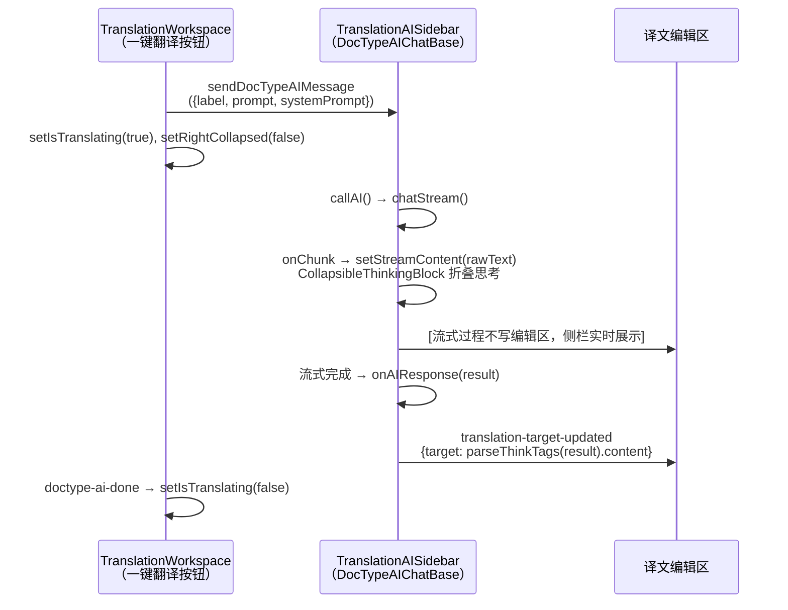
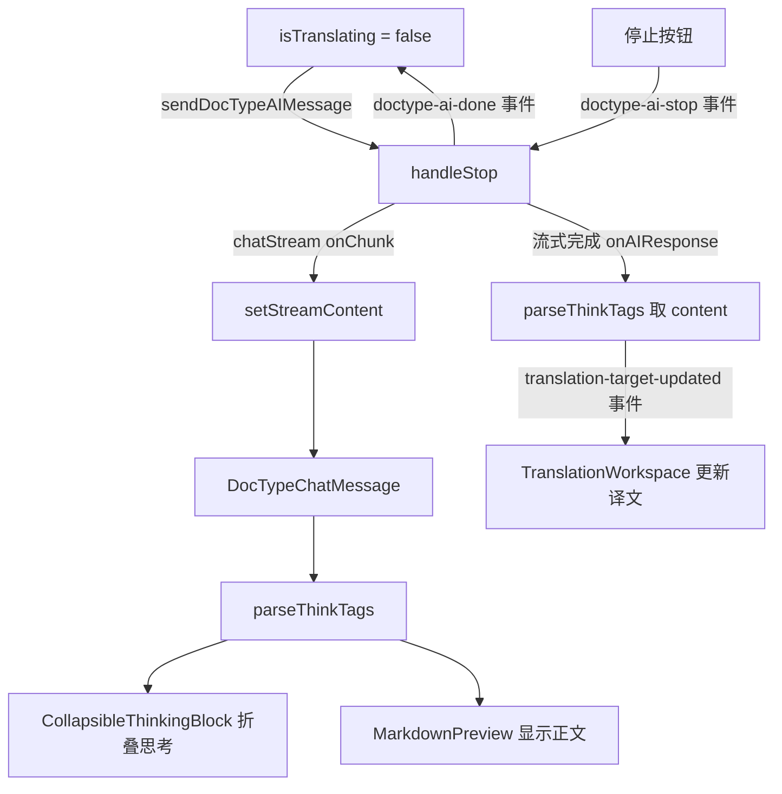

## Product Overview

一键翻译功能当前直接在主编辑区调用 `chatStream`，推理模型的思考过程被 `extractEffectiveTranslation` 兜底逻辑当作译文输出到编辑区，用户看到的是混杂了思考过程的乱码内容。

## Core Features

- 一键翻译点击后，思考内容显示在 AI 聊天侧栏中（折叠显示），翻译正文实时显示在译文编辑区
- 侧栏未打开时自动打开
- 停止按钮正确停止侧栏的流式输出
- 翻译完成后自动持久化译文

## Tech Stack

- 现有项目技术栈：React + TypeScript + Tauri + Zustand
- 窗口事件通信：`doctype-ai-send` / `doctype-ai-stop` / `doctype-ai-done`（已有基础设施）

## Implementation Approach

将一键翻译从"直接调 `chatStream` 写入编辑区"重构为"通过侧栏统一流式处理"，复用 `DocTypeAIChatBase` 已有的思考折叠渲染能力（`CollapsibleThinkingBlock`）。

### 核心思路

1. **TranslationWorkspace.tsx `handleAITranslate`**：删除直接调用 `host.ai.chatStream` 的全部逻辑（约 40 行），改为通过 `sendDocTypeAIMessage` 发送翻译请求到侧栏，同时设置 `isTranslating=true` 并自动打开侧栏
2. **TranslationWorkspace.tsx 流式进度同步**：监听 `doctype-ai-done` 和 `doctype-ai-streaming` 事件来同步 `isTranslating` 状态，停止按钮改为发 `doctype-ai-stop` 事件
3. **TranslationAISidebar.tsx `onAIResponse`**：添加 `onAIResponse` 回调，翻译完成时用 `parseThinkTags` 提取正文，通过 `translation-target-updated` 自定义事件写入编辑区
4. **`handleInsertToTarget` 逻辑变更**：`onAIResponse` 收到的是原始文本（含 think 标签），需用 `parseThinkTags` 分离后取 `content` 字段作为译文

### 数据流



### 关键技术决策

1. **为什么不直接在主编辑区流式**：主编辑区没有 `CollapsibleThinkingBlock`，无法优雅地折叠显示思考过程；侧栏已有完整的思考解析+折叠渲染管线
2. **为什么用事件通信而非 props**：`sendDocTypeAIMessage` / `doctype-ai-done` / `doctype-ai-stop` 是项目已有的事件通信基础设施（`DocTypeAIChatBase` 内置监听），无需引入新的通信机制
3. **流式过程中编辑区不更新**：推理模型可能先思考 10 秒再输出正文，频繁更新编辑区无意义；侧栏已有实时流式渲染能力
4. **删除 `extractEffectiveTranslation`**：不再需要这个兜底函数，因为侧栏的 `parseThinkTags` + `CollapsibleThinkingBlock` 已天然处理了思考分离

### Performance & Reliability

- 删除一键翻译中 `chatStream` + `AbortController` + `stop_ai_stream` 的直调逻辑，消除独立的流式连接管理
- 侧栏只增加一个 `onAIResponse` 回调（React callback ref），无额外性能开销
- `parseThinkTags` 是 O(n) 的正则匹配，对流式文本无性能瓶颈

## Implementation Notes

- `handleAITranslate` 中 `saveTrans({ ...trans, target: '' })` 清空译文的操作保留在发送事件之前，让用户知道正在翻译
- 停止按钮 `handleStopTranslating` 改为 `sendDocTypeAIStop({ documentId: doc.id })` 事件，同时删除 `abortControllerRef` / `streamRequestIdRef` 相关代码（这些是直调 `chatStream` 时才需要的）
- 删除 `extractEffectiveTranslation` 函数（约 30 行），侧栏 `handleInsertToTarget` 中的 `parseThinkTags` 回退保留（侧栏用户手动点击"替换译文"时的防御逻辑）
- `onAIResponse` 的 result 是原始累积文本（含 think 标签），需用 `parseThinkTags(result).content` 提取正文

## Architecture Design

复用已有的 `DocTypeAIChatBase` 事件通信架构，不引入新机制。



## Directory Structure

```
apps/desktop/src-ui/src/document-types/translation/
├── TranslationWorkspace.tsx    # [MODIFY] 重写 handleAITranslate 为事件驱动，删除 extractEffectiveTranslation
├── TranslationAISidebar.tsx    # [MODIFY] 添加 onAIResponse 回调自动写入译文
├── types.ts                    # [NO CHANGE]
├── TranslationExportDialog.tsx # [NO CHANGE]
├── TranslationSettingsDialog.tsx # [NO CHANGE]
└── translationExporter.ts      # [NO CHANGE]

apps/desktop/src-ui/src/document-types/_shared/
├── DocTypeAIChatBase.tsx       # [MODIFY] export sendDocTypeAIStop 辅助函数
└── DocTypeChatMessage.tsx      # [NO CHANGE]
```

## Agent Extensions

No agent extensions needed for this task.