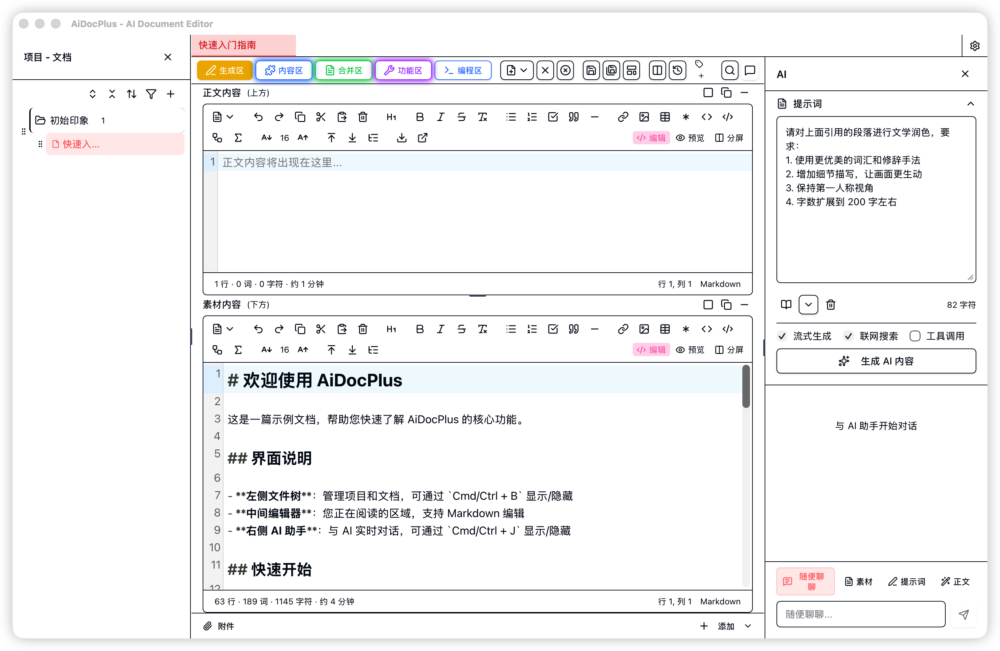
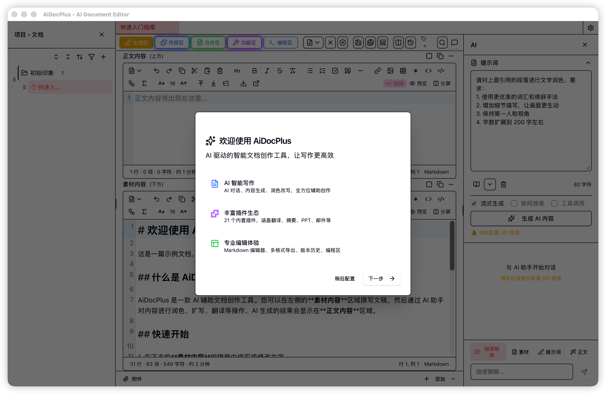
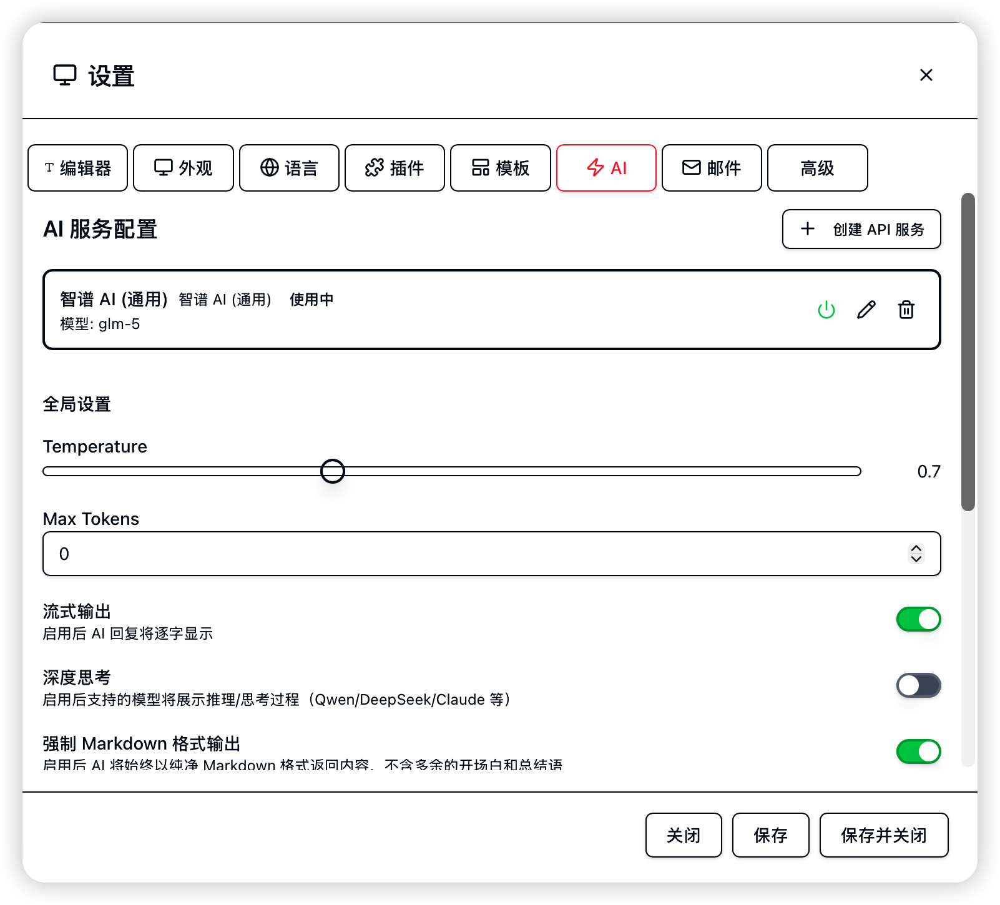

# 快速开始

本教程帮助你在 5 分钟内上手 AiDocPlus。

## 了解界面

启动 AiDocPlus 后，你会看到主界面：

### 五大工作区

通过工具栏按钮或菜单 **视图** 切换：

| 工作区 | 说明 |
|--------|------|
| **生成区** | Markdown 编辑器 + AI 内容生成（双栏布局） |
| **内容区** | 内容生成类插件（翻译、扩写、PPT、摘要等） |
| **合并区** | 将素材、AI 生成、人工编辑等多来源整合为终稿 |
| **功能区** | 功能类插件（邮件发送、文档加密、格式转换等） |
| **编程区** | 集成代码编辑器 + AI 辅助编程环境 |

## 第一步：配置 AI 服务

首次启动时，程序会自动弹出新手引导。你也可以通过菜单 **帮助 → 新手引导** 重新打开。

手动配置步骤：
1. 点击标签栏右侧的 ⚙️ 按钮打开**设置面板**
2. 选择 **AI 设置** 标签
3. 选择一个 AI 服务商（推荐**智谱 AI**，新用户赠送 2000 万 Tokens）
4. 填入 API Key
5. 点击 **测试连接** 验证

> 详细教程：[如何获取智谱 AI API Key](./zhipu-api)

## 第二步：创建项目和文档

1. 在左侧文件树中点击 **新建项目** 按钮
2. 输入项目名称，选择保存位置
3. 在项目下点击 **新建文档** 创建 Markdown 文档

## 第三步：使用 AI 助手

1. 在编辑器左栏输入你的素材或大纲
2. 在右侧 **AI 面板** 中输入指令，例如："根据大纲扩写为完整文章"
3. 或点击 **模板** 按钮选择一个提示词模板
4. AI 生成的内容会自动填入编辑器右栏
5. 审阅后将需要的内容采纳到左栏

## 第四步：使用合并区

1. 点击工具栏的 **「合并区」** 按钮
2. 合并区提供双栏对比视图：
- **左栏**：你的原始内容（素材）
- **右栏**：AI 生成的内容

可以逐段审阅 AI 生成的内容，选择性地插入到原始文档中。

## 第五步：使用内容区与功能区

1. 点击工具栏的 **「内容区」** 按钮，切换到内容插件工作区
2. 左侧显示插件列表（翻译、摘要、PPT 生成等），选择需要的插件
3. 在右侧插件面板中输入内容并执行
4. 点击 **「功能区」** 按钮可切换到功能插件（邮件发送、文档加密等）
5. 点击 **「生成区」** 按钮切回编辑器

## 第六步：保存与导出

### 保存文档
- `Cmd/Ctrl + S` — 保存当前文档
- `Cmd/Ctrl + Shift + S` — 保存所有打开的文档
- 每次保存自动创建版本快照，可通过 `Cmd/Ctrl + H` 查看版本历史

### 导出文档
- 菜单 **文件 → 导出** 或工具栏导出按钮
- 支持格式：Markdown、HTML、Word (.docx)、PDF、纯文本

## 下一步

- [生成区详解](../guide/editor) — 深入了解编辑器功能
- [AI 对话与生成](../guide/ai-chat) — AI 助手的高级用法
- [内容区与功能区](../guide/plugins) — 28 个内置插件

[← 返回文档首页](../)
